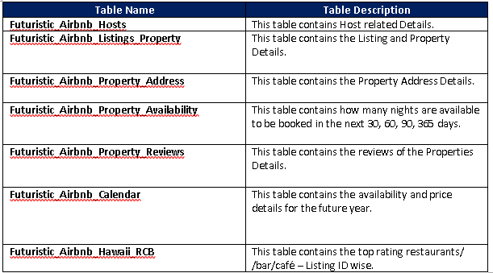
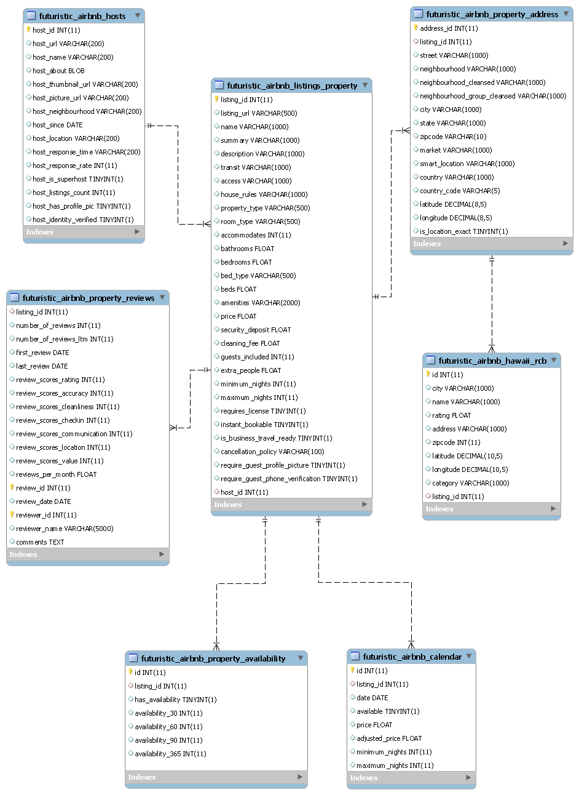

# <ins> Futuristic-Airbnb-ETL </ins>

## <ins> Project Goal  </ins>

(ETL) is the general procedure of copying data from one or more sources into a destination system, which represents the data differently from the source(s) or in a different context than the source(s).    
Our Project Aim is to perform the below activities as part of ETL phase.  

	<b>Extract</b> is the process of extracting data from multiple and different types of sources.  

	<b>Transform</b> is the process of converting the extracted data from its previous form into the form it needs to be in so that it can be placed into a target database. Transformation occurs by using rules or lookup tables or by combining the data with other data.  

	<b>Load</b> is the process of writing the data into the target database.  

## <ins> Source Data </ins>

The Data Set Used for the Project:

Source Data

1)	http://insideairbnb.com/about.html
2)	https://www.kaggle.com/datasets

API Data 
1)	https://api.yelp.com/v3/businesses/search
2)	https://maps.googleapis.com/maps/api/geocode/json?

The Data Files used for this project is as below. 
•	<b>listings.csv </b> : This file contains about the Airbnb Host, listing and Property Information’s. It also contains about the reviews scores & availability details of the property.  
•	<b> reviews.csv </b> : This file contains about the review information of the property.  
•	<b> calendar.csv </b> : This file contains about the Property availability and its price information for the future year.
 
•	<b> places.csv </b> : This file contains about the top 20 popular places and their latitude and longitude values. 
  
We have used the <b> Yelp and Google api </b> to retrieve the top rated restaurants/café/bars for each listing.

## <ins> Target Data </ins>

## <ins> ERR Diagram </ins>

